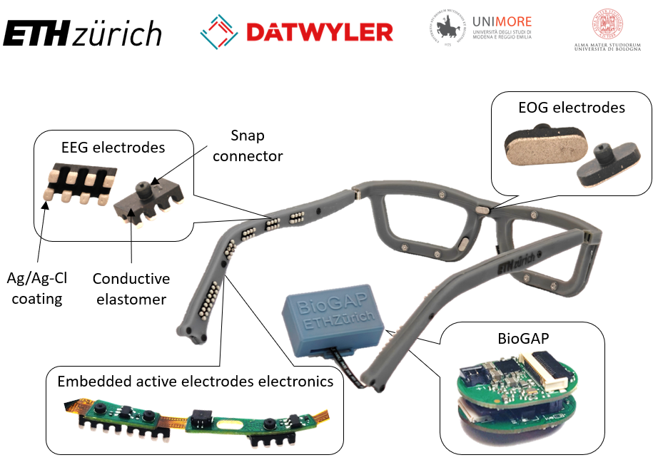
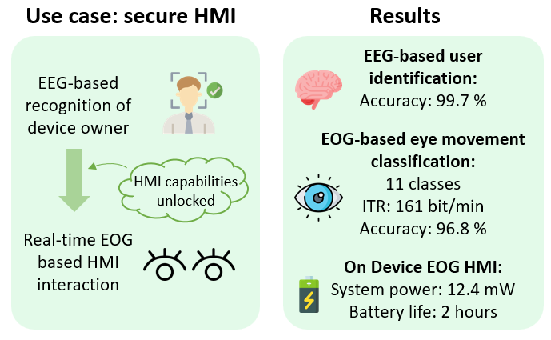
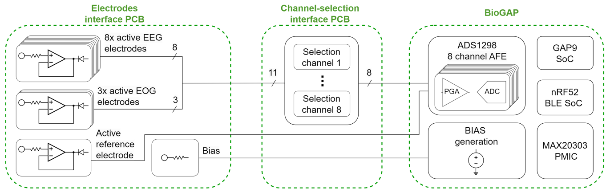

# GAPses: 
## GAP9 based smart glasses for EEG and EOG acquisition and processing



# Introduction

This repository contains the work in progress on the GAPses project.

GAPses are a pair of smart glasses for comfortable and fully dry acquisition and processing of EEG and EOG. The glasses are suitable for extended wear and various biopotential-based applications, including Human-Machine Interaction (HMI), biometric subject recognition, and real-time EEG/EOG analysis.


### Key Features
- **Lightweight & Comfortable**: The fully assembled glasses weigh only 40g and support unobtrusive, all-day wear.
- **Fully Dry Electrodes**: Custom soft electrodes provide stable contact without skin preparation.
- **Sleek Frame Design**: A sleek frame that discreetly houses electrodes and PCBs, ensuring a secure, comfortable fit for daily use.
- **Secure HMI Demonstration**: GAPses showcases a two-step Human-Machine Interaction (HMI) use case, where EEG-based biometric recognition (BrainMetrics) unlocks the device, followed by EOG-based HMI with a high information transfer rate.
- **End-to-End Edge Implementation**: The entire HMI use case, from BrainMetrics to EOG-based interactions, is processed on-device with GAP9’s ultra-low-power capabilities, enabling continuous, privacy-preserving operation on the edge.



## System Diagram

The GAPses system comprises several key components:
- **BioGAP Acquisition and Processing Platform**: This platform enables real-time EEG and EOG data acquisition, processing, and classification on the edge with ultra-low power consumption using the GAP9 RISC-V processor.
- **Electrode Interface PCB**: A flex-rigid PCB embedded in the frame with active signal buffering stages and a direct PCB to electrode interface, reducing interference and artifacts.
- **Channel-Selection Interface PCB**: Allows users to switch between EEG-only and combined EEG-EOG configurations, optimizing channel selection for different use cases.



# Structure of the repository

This repository has the following folders:

- `hardware`, containing the Altium designer PCB source files and the frame design files 
    - Electrodes interface PCB (located at `hardware/PCBs/electrodes_interface_pcb`)
	- Breakout PCB (located at `hardware/PCBs/breakout_pcb`)
    - Frame files (located at `hardware/frame`)

- `documents`, containing the project documentation

# Citation
If you would like to reference the project, please cite the following paper:

```
@ARTICLE{frey2024gapses,
  author={Frey, Sebastian and Lucchini, Mattia Alberto and Kartsch, Victor and Ingolfsson, Thorir Mar and Bernardi, Andrea Helga and Segessenmann, Michael and Osieleniec, Jakub and Benatti, Simone and Benini, Luca and Cossettini, Andrea},
  journal={IEEE Transactions on Biomedical Circuits and Systems}, 
  title={GAPses: Versatile smart glasses for comfortable and fully-dry acquisition and parallel ultra-low-power processing of EEG and EOG}, 
  year={2024},
  volume={},
  number={},
  pages={1-11},
  keywords={Electroencephalography;Electrooculography;Electrodes;Glass;Smart glasses;Wireless communication;Biomedical monitoring;Wireless sensor networks;Sensors;Monitoring;BCI;EEG;embedded deployment;EOG;HMI;smart glasses;wearable devices},
  doi={10.1109/TBCAS.2024.3478798}}
```

# License

This project is open source. See the [LICENSE.README](./LICENSE.README.md) file for details.
